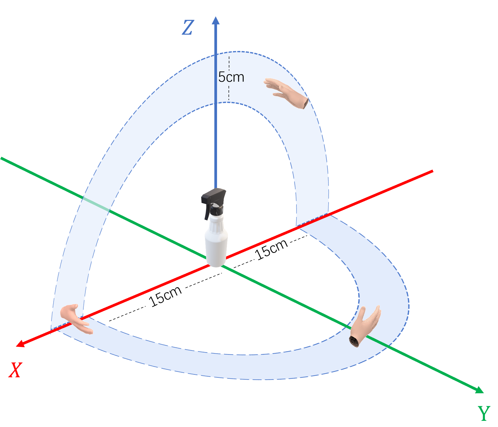

# DexGraspMotionChallenge2025

## Overview

This repository provides example code for training and testing on grasping trajectories of a single object. It demonstrates how to set up the training pipeline and evaluate the performance of learned policies within a simulated environment. The network used in the example code of this repo is based on [**DexRepNet**](https://github.com/LQTS/DexRep_Isaac).


## 1. Environment Setup

### Environment Information (Tested)

#### Operating System
- **OS**: Ubuntu 20.04.3 LTS  
- **CUDA**: 11.3


#### Build Tools
| Tool     | Version     |
|----------|-------------|
| `gcc`    | 8.4.0       |
| `g++`    | 8.4.0       |

### Environment Installation

- Create a conda environment
  
  <pre><code>git clone https://github.com/DexGraspMotionChallenge/DexGraspMotionChallenge2025.git
  cd DexGraspMotionChallenge2025
  conda create -n DexGraspMotionChallenge2025 python==3.8.19
  conda activate DexGraspMotionChallenge2025</code></pre>

- Install IsaacGym
  - Download [IsaacGym](https://developer.nvidia.com/isaac-gym/download)
  - Extract the downloaded files to the main directory of the project
  - Use the following command to install IsaacGym
  <pre><code>cd ./isaacgym/python
  pip install -e .</code></pre>
- Install other dependencies
  <pre><code>bash install.sh</code></pre>

If you encounter the error `ImportError: libpython3.8.so.1.0: cannot open shared object file: No such file or directory`, please run the following command.

<pre><code>sudo apt update
sudo apt install libpython3.8-dev</code></pre>

> **Note:** This repo is based on g++ version 8.4.0. If your g++ version is too high, you can upgrade the `transformations` and `numpy` packages to compatible versions.
  
## 2. Dataset Download
**Please send an email to `DexGraspMotionChallenge@outlook.com` to request access to the dataset on Google Drive. In your email, please include your registered team name, institution, and a Google email address.** If you do not receive a response to your email within two days, please submit an issue via this repository.

**You can download the mesh data of objects in GraspM3** from the [this link](https://drive.google.com/drive/folders/1nBVx9aubPUOk_FHKR8ec5tkQrTQcF2qq?usp=sharing).The file is named `meshdata.tar.gz`. 

The structure of the mesh data for a single object is as follows:

<pre><code>meshdata/
├── core-bottle-a02a1255256fbe01c9292f26f73f6538/
│   └── coacd/
│       ├── coacd.urdf
│       ├── coacd_1.urdf
│       ├── decomposed.obj
│       ├── decomposed.wrl
│       ├── decomposed_log.txt
│       ├── model.config
│       ├── coacd_convex_piece_0.obj
│       ├── coacd_convex_piece_1.obj
│       ├── coacd_convex_piece_2.obj
│       ├── coacd_convex_piece_3.obj
│       └── coacd_convex_piece_4.obj</code></pre>

**You can download the GraspM3 dataset** from the [this link](https://drive.google.com/drive/folders/1nBVx9aubPUOk_FHKR8ec5tkQrTQcF2qq?usp=sharing).The file is named `GraspM3.tar.gz`.

The compressed package contains multiple `.npy` files, each named after the object ID.

Each `.npy` file is a dictionary with the following keys:

- `obj_rotmat`: (B, 3, 3) array of object rotation matrices.
- `obj_scale`: (B,) array of object scaling factors.
- `grasp_seqs`: (B, T, D) array representing grasp trajectories.
  
Here, B is the number of trajectories, T is the sequence length, and D = 28 is the dimension of each grasp step, consisting of:
- the first 3 dimensions: global translation of the hand,
- the next 3 dimensions: global rotation of the hand,
- the remaining 22 dimensions: joint angles of the hand.

> **Note:** The translation parameters of the hand are defined relative to the reference point \([0, 0, 1]\).  
> For example, if the z-axis translation value of the hand is `-0.2`, it corresponds to a world coordinate z-value of `0.8`.

The illustration of the initial pose of the dexterous hand is shown below.


  
## 3. Training and Testing Examples

We provide example code for training and testing, both conducted on a **single object**. 

Our method utilizes [DexRep](https://arxiv.org/pdf/2303.09806), a representation for dexterous grasping that encodes both geometric and spatial hand-object information. DexRep consists of three components: (1) Occupancy Feature, (2) Surface Feature, and (3) Local-Geo Feature.

In our baseline, we use a multi-layer perceptron (MLP) as the policy network trained on top of DexRep features extracted from hand-object configurations.

### Training Example

Before training the model, please download GraspM3 from [this link](https://drive.google.com/drive/folders/1nBVx9aubPUOk_FHKR8ec5tkQrTQcF2qq?usp=sharing) and place a subset of the dataset in either `./dexgrasp/dataset/train` or `./dexgrasp/dataset/valid` as needed.

Run the training with:

<pre><code>cd dexgrasp
python train_bc_lighting_dexrep.py</code></pre>

The data in `./dexgrasp/dataset/train` and `./dexgrasp/dataset/valid` included **in this demo** contains **pre-extracted features**, but these features are **not** included in `GraspM3.tar.gz`.

The data preprocessing code can be found in [data_preprocess.py](https://github.com/DexGraspMotionChallenge/DexGraspMotionChallenge2025/blob/main/dexgrasp/data_preprocess.py). Currently, the training pipeline supports **online feature extraction**, which can be time-consuming. If you prefer to **preprocess the data and save the extracted features**, please run the following command:

<pre><code>python data_preprocess.py --task=ShadowHandGraspDexRepIjrr2 --algo=ppo1 --seed=0 --rl_device=cuda:0 --sim_device=cuda:0 --logdir=logs/dexrep_dexgrasp --headless</code></pre>

If an **out-of-memory error** occurs during data preprocessing, please process the data in **smaller batches**.

During training, you can **modify the number of trajectories used** by changing the `seq_num` and `val_seq_num` parameters in [lhm_bc.yaml](https://github.com/DexGraspMotionChallenge/DexGraspMotionChallenge2025/blob/main/ActionDiffusion/bc/config/lhm_bc.yaml). The detailed data loading process can be found in the [GraspM3DexRepDataset](https://github.com/DexGraspMotionChallenge/DexGraspMotionChallenge2025/blob/5647adc5494dca3d94bad55765e6d6214e4ebe9c/ActionDiffusion/bc/dataset/graspm3_dexrep.py#L44) class.

### Testing Example

Run the following command to perform testing, this code can evaluate the **grasp success rate**:

<pre><code>python -u bc_env_infer.py --task=ShadowHandGraspDexRepIjrr --algo=ppo1 --seed=0 --rl_device=cuda:0 --sim_device=cuda:0 --logdir=logs/dexrep_dexgrasp --headless</code></pre>

If you want to **enable visualization**, please remove `--headless` from the command.

The **configurations** for **Isaac Gym** can be found in [shadow_hand_grasp_dexrep_ijrr.yaml](https://github.com/DexGraspMotionChallenge/DexGraspMotionChallenge2025/blob/main/dexgrasp/cfg/shadow_hand_grasp_dexrep_ijrr.yaml) and [shadow_hand_grasp_dexrep_ijrr.py](https://github.com/DexGraspMotionChallenge/DexGraspMotionChallenge2025/blob/main/dexgrasp/tasks/shadow_hand_grasp_dexrep_ijrr.py).

If you have trained your own model, please modify the `checkpoints` parameter in [lhm_bc.yaml](https://github.com/DexGraspMotionChallenge/DexGraspMotionChallenge2025/blob/main/ActionDiffusion/bc/config/lhm_bc.yaml) and the `obj_type` parameter in [shadow_hand_grasp_dexrep_ijrr.yaml](https://github.com/DexGraspMotionChallenge/DexGraspMotionChallenge2025/blob/main/dexgrasp/cfg/shadow_hand_grasp_dexrep_ijrr.yaml) before running inference.

If you want to evaluate **human-likeness**, please run the example code with the following command.

<pre><code>python traj_reconstruct_error.py</code></pre>

## Citation

```bibtex
@inproceedings{liu2023dexrepnet,
  title={Dexrepnet: Learning dexterous robotic grasping network with geometric and spatial hand-object representations},
  author={Liu, Qingtao and Cui, Yu and Ye, Qi and Sun, Zhengnan and Li, Haoming and Li, Gaofeng and Shao, Lin and Chen, Jiming},
  booktitle={2023 IEEE/RSJ International Conference on Intelligent Robots and Systems (IROS)},
  pages={3153--3160},
  year={2023},
  organization={IEEE}
}
```

